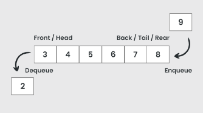

***About***

- Estrutura de dados linear que é aberta em ambas as extremidades e as operações são executadas na ordem “FIFO”(First in, First out)b
- Pode lidar com diversos dados, podemos acessar ambas as extremidades, são rapidas e flexiveis

***Tipos de fila***
- Fila restrita de entrada: apenas é possivel entrar ou no “head” ou no “back” porem sua exclusão pode ser feita em qualquer um dos lados
- Fila restrita de saida: ela é simples a entrada pode ser tanto no “head” quanto no “back” porem a exclusão será feita apenas em uma das extremidades
- Fila circular: 
- Fila Dupla(Dequeue): podemos adicionar itens tanto no “topo(head)” quando no “back” e retirar tambem
- Fila prioritaria: aqui temos um tipo fila onde os elementos são acessados com base na sua prioridade

***Operações***
- enqueue(): adicionar elementos no final da fila
- dequeue(): remove o elemento da fila
- isFull(): verifica se a fila esta cheia
- isEmpty(): verifica se a fila esta vazia
- rear(): retorna o elemento no “back” sem remove-lo
- front(): retorna o elemento no “head” sem remove-lo